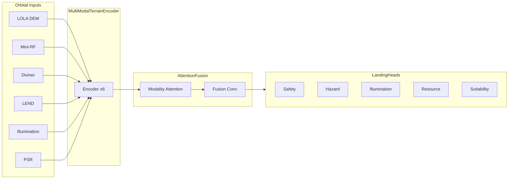

# Landing Site Intelligence — Architecture Report

## 1. Mission Objective

Predict geospatial landing suitability from six orbital modalities, producing five interpretable score maps for mission planning:

| Output | Range | Meaning |
|--------|-------|---------|
| Landing Safety Score | 0–1 | Terrain stability and low hazard |
| Hazard Probability | 0–1 | Rock fields, steep slopes, rough radar |
| Illumination Score | 0–1 | Solar visibility for operations |
| Resource Accessibility Score | 0–1 | Hydrogen / volatile access near surface |
| Final Landing Suitability Score | 0–1 | Weighted composite for site ranking |

## 2. System Overview

## 3. Model Components

### 3.1 MultiModalTerrainEncoder

Each modality has a dedicated two-layer CNN encoder:

- Conv-BN-ReLU (3×3, stride 1)
- Conv-BN-ReLU (3×3, stride 2) → halves spatial resolution

Default feature dimension: **32 channels** per modality.

### 3.2 AttentionFusion

1. Concatenate encoded features along the channel axis (6 × 32 = 192 channels).
2. Predict per-pixel modality attention weights via 1×1 convolutions + softmax.
3. Re-weight modality features and concatenate.
4. Fuse with a 3×3 convolution to 64 channels.

This allows the network to emphasize topography near craters, radar near rough terrain, or thermal/neutron data near PSR boundaries.

### 3.3 LandingHeads

Five parallel `_ScoreHead` branches (Conv-BN-ReLU → 1×1 Conv → Sigmoid), one per task. Outputs are bilinearly upsampled to the input patch resolution inside `LandingSiteNet.forward`.

## 4. Training Pipeline

### 4.1 Dataset

`LandingSiteDataset` generates synthetic multi-modal patches and **physics-correlated pseudo-labels**:

- Slope from LOLA finite differences → hazard / safety
- Illumination channel → illumination score
- LEND + inverse PSR → resource accessibility
- Weighted composite → final suitability

### 4.2 Loss Function

`LandingSiteLoss`:

| Term | Type | Target |
|------|------|--------|
| safety_loss | MSE | landing_safety_score |
| hazard_loss | BCE | hazard_probability |
| illumination_loss | MSE | illumination_score |
| resource_loss | MSE | resource_accessibility_score |
| suitability_loss | MSE | final_suitability_score |
| slope_penalty | Physics | Penalize high safety on steep slopes |

The slope penalty implements mission-relevant constraints: predicting “safe” on terrain above `slope_threshold` incurs additional loss proportional to predicted safety confidence.

### 4.3 Metrics

- **safety_mse** — Regression quality for safety maps
- **hazard_accuracy** — Binary accuracy at 0.5 threshold
- **suitability_mse** — Regression quality for composite score

### 4.4 Trainer Features

- Train/validation split
- AdamW optimizer with weight decay
- Gradient clipping
- Optional AMP on CUDA
- Per-epoch and best-checkpoint saving
- Early stopping on validation loss

## 5. Inference Pipeline

`InferencePipeline`:

1. Loads `best.pt` (or specified checkpoint)
2. Runs batched forward passes on synthetic or real patches
3. Exports NumPy arrays and `summary.json` to the output directory

Entry point: `predict.py`.

## 6. Production Considerations

| Topic | Current Implementation | Production Extension |
|-------|------------------------|----------------------|
| Data | Synthetic smoke dataset | GeoTIFF loaders from `shared/` + real LOLA/Mini-RF/Diviner/LEND stacks |
| Spatial reference | Normalized patches | IAU Moon CRS tiling via shared geospatial utilities |
| Uncertainty | Point estimates | Evidential or MC-dropout heads |
| Deployment | NumPy export | ONNX / TorchScript + mission GIS integration |

## 7. File Map

| Module | Responsibility |
|--------|----------------|
| `terrain_encoder.py` | Per-modality CNN encoders |
| `fusion.py` | Attention-based fusion |
| `heads.py` | Multi-task prediction heads |
| `landing_site_net.py` | End-to-end forward pass |
| `dataset.py` | Synthetic data + collate |
| `losses.py` | Multi-task + physics loss |
| `metrics.py` | Safety MSE, hazard accuracy |
| `trainer.py` | Training loop |
| `checkpoint.py` | Save/load state |
| `inference.py` | Batch prediction + export |

## 8. Verification

Smoke tests validate:

- Forward pass shape and value ranges (`run_model_smoke.py`)
- Single-batch training + checkpoint round-trip (`run_train_smoke.py`)
- Inference export pipeline (`run_predict_smoke.py`)

All modules compile with `py_compile` before release.
