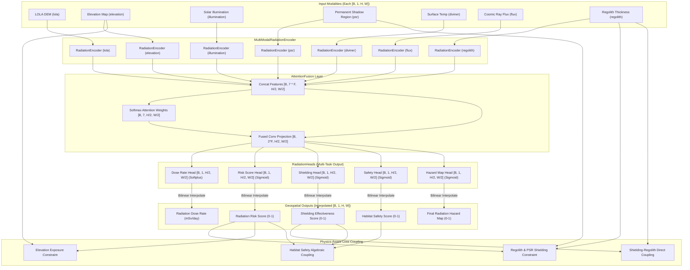

# Architecture Specification — Lunar Radiation Risk Prediction AI System

This document outlines the software and deep learning architecture of the Model 4 Lunar Radiation Risk Prediction AI system.

## System Block Diagram

---

## Modality Specifications

The model processes 7 distinct geospatial layers corresponding to orbital instrument readings or simulated environments:

1. **lola**: Lunar Orbiter Laser Altimeter DEM mapping terrain profile.
2. **elevation**: Calibrated elevation measurements.
3. **illumination**: Cumulative solar illumination factor mapping exposure to solar radiation.
4. **psr**: Permanent Shadow Region mask designating crater interiors shielded from direct solar illumination.
5. **diviner**: Diviner Lunar Radiometer thermal maps correlating with heat and shadow.
6. **flux**: Solar particle events (SPE) and Galactic Cosmic Rays (GCR) exposure models.
7. **regolith**: Estimated depth/thickness profile of the lunar regolith.

Each modality is individually processed by an spatial `RadiationEncoder` consisting of 2D convolutions, batch normalization, and ReLU activations, reducing resolution by a factor of 2 (via stride=2) to increase receptive field.

---

## Attention Fusion Mechanism

The features are combined using a spatial/modality softmax attention mechanism:
1. **Concatenation**: Extracted features of dimension $F$ for the 7 modalities are stacked along the channel axis.
2. **Modality Weighting**: A $1\times 1$ convolution calculates spatial/modality attention coefficients.
3. **Softmax**: Attention logits are normalized using a softmax activation across modalities.
4. **Channel Projection**: Modalities are scaled by their spatial weights, concatenated, and projected through a $3\times 3$ convolutional block to a combined dimension of $2 \times F$.

---

## Physics-Aware Loss Formulation

To ensure the model learns physically consistent mappings even with noisy data, the loss objective incorporates regularizations:

$$L_{\text{total}} = L_{\text{supervised}} + \lambda_{\text{physics}} L_{\text{physics}}$$

Where $L_{\text{supervised}}$ is the multi-task MSE and BCE loss, and $L_{\text{physics}}$ comprises:

1. **Regolith & PSR Shielding constraint**:
   High regolith thickness and shadow zone interiors block radiation, defining a physical upper limit on radiation risk:
   $$L_{\text{shielding}} = \text{ReLU}\left(S_{\text{risk}} - (1.0 - 0.5 \cdot \text{regolith} - 0.3 \cdot \text{psr})\right)$$

2. **Elevation Exposure constraint**:
   Exposed elevated terrains lack local topography shielding, imposing a lower limit on radiation risk:
   $$L_{\text{exposure}} = \text{ReLU}\left(0.6 \cdot \text{elevation} - S_{\text{risk}}\right)$$

3. **Shielding Effectiveness coupling**:
   Alignspredicted shielding effectiveness directly with regolith thickness:
   $$L_{\text{shield\_eff}} = \text{MSE}\left(S_{\text{shielding}}, \text{regolith}\right)$$

4. **Habitat Safety coupling**:
   Habitat safety represents the interaction of shielding protection and radiation hazard:
   $$L_{\text{safety}} = \text{MSE}\left(S_{\text{safety}}, S_{\text{shielding}} \times (1.0 - S_{\text{risk}})\right)$$
