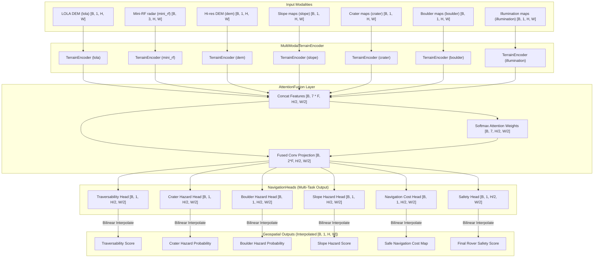

# Architecture Specification — Rover Hazard & Navigation Intelligence (Model 5)

This document describes the software and machine learning architecture of the Model 5 Rover Hazard & Navigation Intelligence system.

## System Block Diagram

---

## Modality Specifications

The model integrates 7 orbital and terrain-based modalities to synthesize hazard and traversability cost maps:
1. **lola**: Low-resolution lunar orbiter laser altimeter topography data.
2. **mini_rf**: 3-channel Mini-RF polarimetric radar mapping surface roughness.
3. **dem**: High-resolution digital elevation model mapping local slopes and micro-topography.
4. **slope**: Pre-calculated surface slope maps.
5. **crater**: Crater probability or rim location density maps.
6. **boulder**: Boulder location/frequency maps.
7. **illumination**: Solar illumination mapping exposure.

---

## Physics-Aware Loss Formulation

To enforce consistent navigation safety and path cost metrics, the multi-task loss is augmented with several physics constraints:

1. **Slope & Boulder Traversability Limit**: Enforces that safe traversability cannot exceed the bounds determined by slopes and boulders:
   $$S_{\text{trav}} \leq 1.0 - \text{slope} - \text{boulder}$$
2. **Slope Hazard direct coupling**: Forces slope hazard predictions to reflect the raw physical input slopes.
3. **Multiplicative safety consistency**: Rover safety score must reflect the joint safety across all individual hazard predictions:
   $$\text{Safety} \approx (1.0 - \text{crater\_hazard}) \times (1.0 - \text{boulder\_hazard}) \times (1.0 - \text{slope\_hazard})$$
4. **Navigation cost map coupling**: Navigation cost is the inverse of predicted safety:
   $$\text{Cost} \approx 1.0 - \text{Safety}$$
5. **Illumination traversability lower limit**: Ensures that good solar illumination combined with low hazards guarantees a baseline traversability level.
