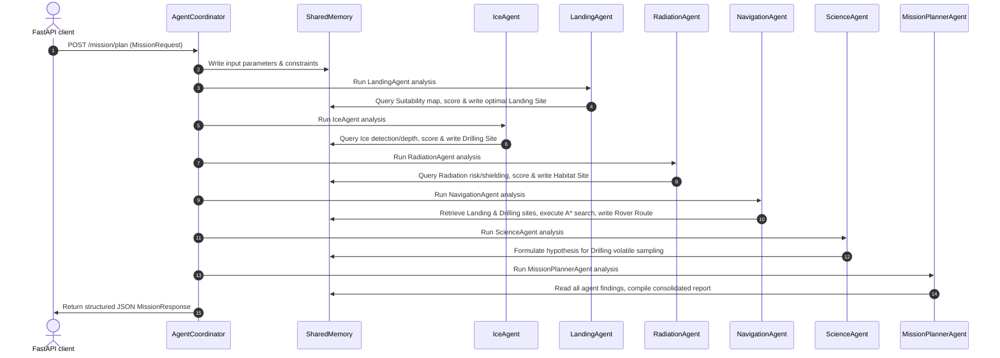

# Architecture Specification — ORACLE Mission Copilot (Model 6)

This document describes the software and agent coordination architecture of the Model 6 ORACLE Mission Copilot system.

## Multi-Agent Interaction Flow

---

## Agent Specifications & Responsibilities

1. **LandingAgent**: Analyzes the landing suitability map, weighing safety margin constraint parameters to choose the most level and safe touchdown coordinate.
2. **IceAgent**: Localizes volatile deposits using ice detection and characterization outputs, maximizing predicted ice concentration and accessibility.
3. **RadiationAgent**: Assesses cosmic ray and solar particle dose rates and shielding thickness to identify optimal low-exposure locations for lunar habitats.
4. **NavigationAgent**: Integrates selected landing and drilling coordinates to trace an A* cost-optimized routing corridor on the traversability cost map.
5. **ScienceAgent**: Formulates geological hypotheses and explains volatile records.
6. **MissionPlannerAgent**: Orchestrates all findings and writes overall risk assessments, hazard factors, and mitigations.

---

## Coordinator State Machine

The sequential orchestration guarantees that later agents (like the NavigationAgent and ScienceAgent) have access to the coordinates and outputs determined by earlier agents (LandingAgent and IceAgent) via the `SharedMemory` board, ensuring a dependency-free execution flow.
